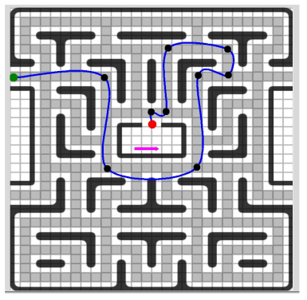

- Run main_live.mlx and observe the output, change "sim_trajectory_id" at
the end to change the trajectory to be used in simulation.
- Open the simulink model you wish to run (files start with "sim_..." in the simulations folder) and
set the simulation duration to the value given at the end after running main_live.
- Run the simulation, and use the logging outputs (click on the "wifi"
symbols on the signals) to visualize the results.

